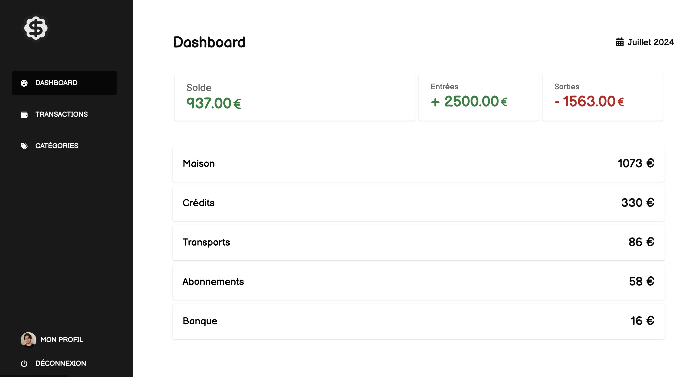

# Meffin

**Meffin** is a small application to calculate a monthly budget by saving recurrent or temporary transactions

- Frontend with [Vue 3](https://vuejs.org/guide/introduction.html)

- Backend with Golang [meffin-transactions-api](https://github.com/lucasnevespereira/meffin-transactions-api)

## 📖 Table of Contents
- [📖 Table of Contents](#-table-of-contents)
- [📍 Overview](#-overview)
- [📦 Features](#-features)
---

## 📍 Overview

Small application to register monthly transactions (incomes or expenses) and calculate balance for current month

---

## 📦 Features

- Create a transaction, income or expense:
  - Description of transaction
  - Amount of transaction
  - Enter transaction day of the month or end date or set just for current month
  - Set transaction as fixed, so it comes back every month

- Update and Delete transaction

- View month transactions and current balance
